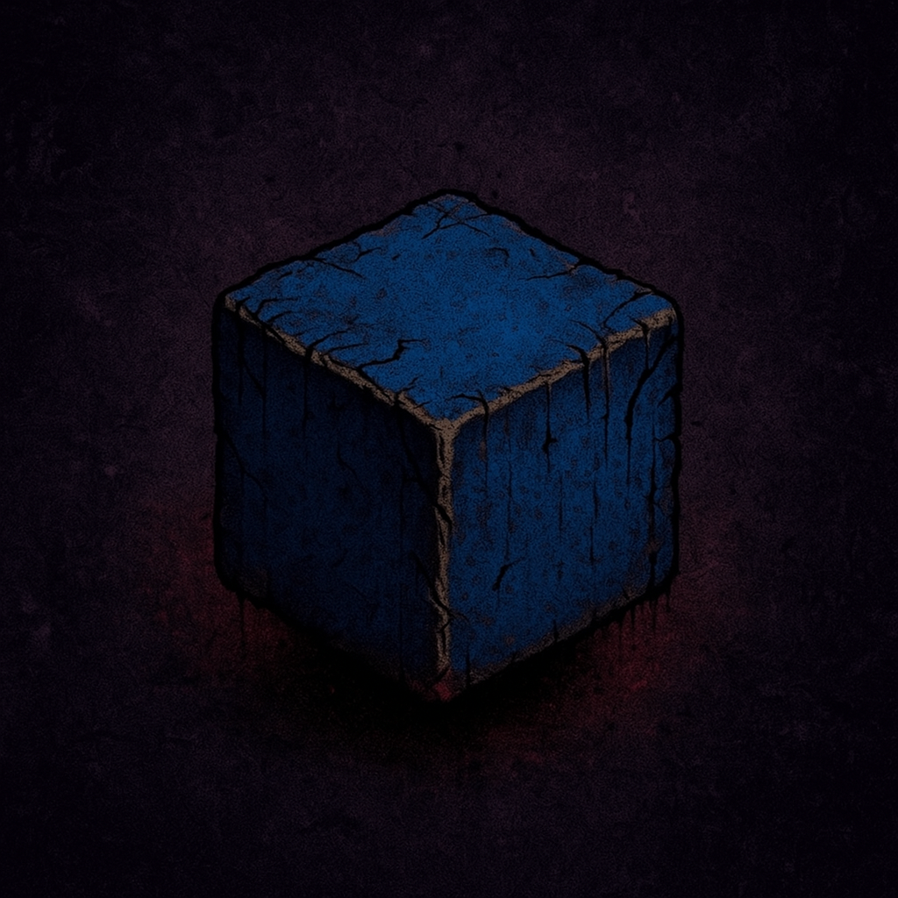

# ERROR_FKNK_REALITY_DISINTEGRATED



---

## 🎮 About the Game
ERROR_FKNK_REALITY_DISINTEGRATED is a surreal, mind-bending 3D experience set in a glitch-infested reality. Players navigate through distorted environments, interact with mysterious objects, and uncover hidden truths while battling the instability of a fragmented world.

- Genre: 3D Adventure / Experimental  
- Platform: PC (Windows)  
- Style: Glitch / Horror  

---

## 🛠 Development
- Developed and tested on **Unity 6 6000.2.5f1** and **6000.2.6f1**  
- Programming language: **C#**  
- Version control: **GitHub**

---

## ⚠️ Disclaimer

All characters, events, and organizations depicted in this project are entirely fictional.  
Any resemblance to real persons, living or dead, or real events, is purely coincidental. 

---

## 📦 How to Build
1. Open the project in Unity 6 (tested versions 6000.2.5f1 and 6000.2.6f1).  
2. Go to **File → Build Settings**.  
3. Select **PC, Mac & Linux Standalone** (Windows).  
4. Click **Build** and choose a folder for the executable.  
5. Wait for Unity to compile and export the project.  


---

## 🎯 Features
- Dynamic glitch effects that distort the environment  
- Interactive objects and puzzles  
- Custom player controls and camera system  
- Procedural event system for unpredictable scenarios  
- Easy-to-expand architecture for new levels and features  

---

## 🧩 Installation
- Install Unity 6 and Git
- Clone this repository using Git:  
```bash
git clone https://github.com/Tironosauroo/ERROR_FKNK_REALITY_DISINTEGRATED.git
```
- Open the project in Unity and let it import all assets and libraries.

---

## 📌 License
All rights reserved. Unauthorized distribution of assets or code is prohibited.

---

## ⚡ Notes

- The project is highly experimental — expect broken or glitchy behavior by design.
- Recommended hardware: mid-tier GPU, 8+ GB RAM.
- Minimal hardware: low-tier GPU, 4+ GB RAM, Windows 10 OS x64.
- Feel free to explore and modify scripts for educational purposes.
